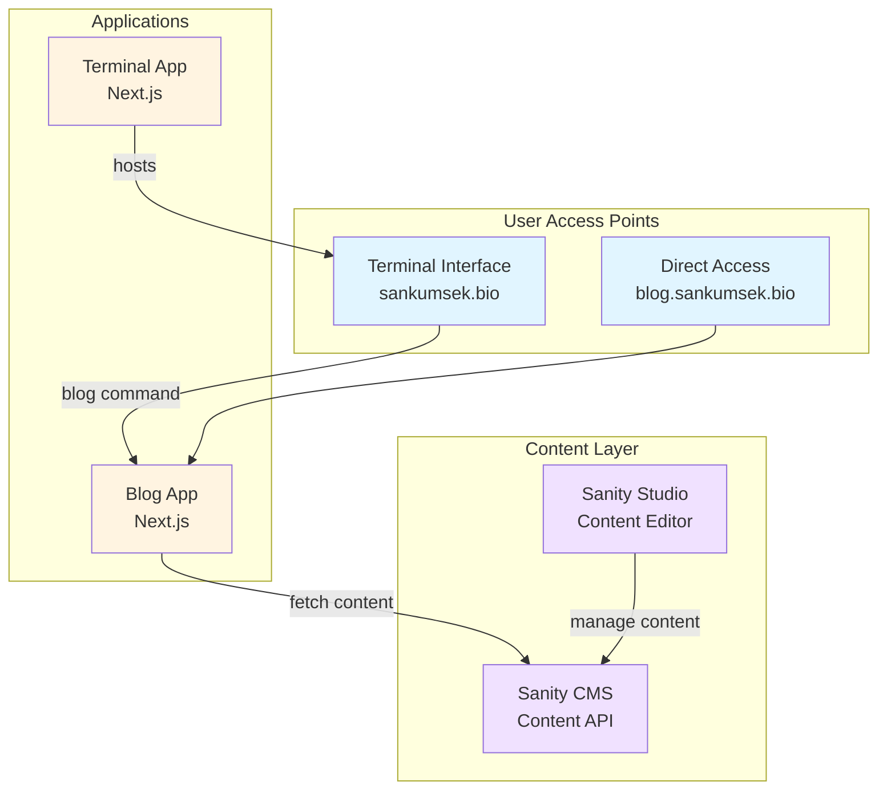

# Design Document: Blog Integration

## Overview

This design specifies the technical implementation for integrating a Sanity-powered blog into the sankumsek.bio terminal-based personal website. The solution consists of three main components:

1. **Terminal Command Extension**: A new "blog" command in the existing terminal interface that navigates users to the blog subdomain
2. **Standalone Blog Application**: A Next.js application deployed at blog.sankumsek.bio, based on the Sanity clean template architecture
3. **Content Management System**: Sanity CMS integration for headless content management with real-time updates

The blog will be accessible both through the terminal command and directly via the subdomain, providing flexibility for different user preferences while maintaining a cohesive experience.

### Key Design Decisions

- **Separate Next.js Application**: The blog will be a separate Next.js app rather than integrated into the existing terminal app, allowing independent deployment, scaling, and maintenance
- **Sanity Portable Text**: Content will be stored and rendered using Sanity's Portable Text format, providing rich text capabilities with structured content
- **Incremental Static Regeneration (ISR)**: Blog posts will use Next.js ISR with 60-second revalidation for optimal performance while ensuring content freshness
- **Monorepo Structure**: Both applications will coexist in the same repository but deploy independently via Vercel's multi-app configuration

## Architecture

### System Architecture



### Directory Structure

```
sankumsek.bio/
├── src/                          # Existing terminal app
│   ├── components/
│   ├── pages/
│   ├── utils/
│   │   └── bin/
│   │       ├── commands.ts       # Add blog command here
│   │       └── index.ts
│   └── styles/
├── blog/                         # New blog application
│   ├── src/
│   │   ├── app/                  # Next.js App Router
│   │   │   ├── layout.tsx
│   │   │   ├── page.tsx          # Blog homepage (post listing)
│   │   │   ├── posts/
│   │   │   │   └── [slug]/
│   │   │   │       └── page.tsx  # Individual post pages
│   │   │   ├── api/
│   │   │   │   └── revalidate/
│   │   │   │       └── route.ts  # Webhook for content updates
│   │   │   └── not-found.tsx
│   │   ├── components/
│   │   │   ├── PostCard.tsx
│   │   │   ├── PostList.tsx
│   │   │   ├── PortableText.tsx
│   │   │   ├── Header.tsx
│   │   │   └── Footer.tsx
│   │   ├── lib/
│   │   │   ├── sanity.client.ts
│   │   │   ├── sanity.queries.ts
│   │   │   └── sanity.image.ts
│   │   └── styles/
│   │       └── globals.css
│   ├── sanity/                   # Sanity configuration
│   │   ├── schema/
│   │   │   ├── post.ts
│   │   │   ├── author.ts
│   │   │   ├── category.ts
│   │   │   └── index.ts
│   │   ├── lib/
│   │   │   └── client.ts
│   │   └── sanity.config.ts
│   ├── public/
│   ├── package.json
│   ├── next.config.js
│   ├── tsconfig.json
│   └── tailwind.config.js
├── package.json                  # Root package.json
├── vercel.json                   # Multi-app deployment config
└── .env.local                    # Environment variables
```

### Deployment Architecture

The solution uses Vercel's multi-project deployment:

- **Main App** (sankumsek.bio): Deploys from root directory
- **Blog App** (blog.sankumsek.bio): Deploys from `/blog` directory
- Both apps share the same Git repository but deploy independently
- Vercel configuration maps subdomains to respective build outputs

## Components and Interfaces

### Terminal Command Component

**Location**: `src/utils/bin/commands.ts`

**Interface**:
```typescript
export const blog = async (args: string[]): Promise<string> => {
  window.open('https://blog.sankumsek.bio', '_blank');
  return 'Opening blog...';
};
```

**Behavior**:
- Registered in the command registry via `src/utils/bin/index.ts`
- Opens blog subdomain in new tab
- Returns confirmation message to terminal
- Ignores any additional arguments
- Appears in help command output automatically

### Blog Application Components

#### 1. Post List Component

**Location**: `blog/src/components/PostList.tsx`

**Purpose**: Displays paginated list of blog posts on homepage

**Interface**:
```typescript
interface PostListProps {
  posts: Post[];
  currentPage: number;
  totalPages: number;
}

interface Post {
  _id: string;
  title: string;
  slug: string;
  excerpt: string;
  publishedAt: string;
  author: Author;
  categories: Category[];
  mainImage?: SanityImage;
}
```

**Behavior**:
- Renders posts in reverse chronological order
- Shows 10 posts per page
- Displays post card with title, excerpt, date, author, and featured image
- Links to individual post pages
- Handles pagination controls

#### 2. Post Card Component

**Location**: `blog/src/components/PostCard.tsx`

**Purpose**: Renders individual post preview in list

**Interface**:
```typescript
interface PostCardProps {
  post: Post;
}
```

**Behavior**:
- Displays featured image with lazy loading
- Shows title, excerpt (truncated to 150 characters)
- Displays publish date in human-readable format
- Shows author name and avatar
- Renders category tags
- Provides click target for navigation

#### 3. Portable Text Component

**Location**: `blog/src/components/PortableText.tsx`

**Purpose**: Renders Sanity Portable Text content as HTML

**Interface**:
```typescript
interface PortableTextProps {
  content: PortableTextBlock[];
}
```

**Behavior**:
- Converts Portable Text blocks to React components
- Handles standard blocks: paragraphs, headings, lists, quotes
- Renders custom blocks: images, code blocks, embeds
- Applies syntax highlighting to code blocks using Prism.js
- Sanitizes content to prevent XSS
- Optimizes images using Next.js Image component

#### 4. Header Component

**Location**: `blog/src/components/Header.tsx`

**Purpose**: Site navigation and branding

**Interface**:
```typescript
interface HeaderProps {
  title: string;
}
```

**Behavior**:
- Displays blog title/logo
- Provides link back to main terminal site
- Responsive mobile menu
- Sticky positioning on scroll

#### 5. Footer Component

**Location**: `blog/src/components/Footer.tsx`

**Purpose**: Site footer with links and metadata

**Behavior**:
- Links back to main site
- Social media links
- Copyright information
- Responsive layout

### Sanity Client Interface

**Location**: `blog/src/lib/sanity.client.ts`

**Purpose**: Configured Sanity client for data fetching

**Interface**:
```typescript
import { createClient } from '@sanity/client';

export const client = createClient({
  projectId: process.env.NEXT_PUBLIC_SANITY_PROJECT_ID,
  dataset: process.env.NEXT_PUBLIC_SANITY_DATASET,
  apiVersion: '2024-01-01',
  useCdn: true, // Use CDN for production
  token: process.env.SANITY_API_TOKEN, // For authenticated requests
});
```

### Sanity Query Interface

**Location**: `blog/src/lib/sanity.queries.ts`

**Purpose**: GROQ queries for fetching content

**Key Queries**:

```typescript
// Fetch all published posts with pagination
export const postsQuery = `
  *[_type == "post" && !(_id in path("drafts.**"))] | order(publishedAt desc) [$start...$end] {
    _id,
    title,
    slug,
    excerpt,
    publishedAt,
    "author": author->{name, image},
    "categories": categories[]->{ title, slug },
    mainImage
  }
`;

// Fetch single post by slug
export const postBySlugQuery = `
  *[_type == "post" && slug.current == $slug && !(_id in path("drafts.**"))][0] {
    _id,
    title,
    slug,
    body,
    publishedAt,
    "author": author->{name, image, bio},
    "categories": categories[]->{ title, slug },
    mainImage,
    seo
  }
`;

// Count total published posts
export const postCountQuery = `
  count(*[_type == "post" && !(_id in path("drafts.**"))])
`;
```

## Data Models

### Sanity Schema Definitions

#### Post Schema

**Location**: `blog/sanity/schema/post.ts`

```typescript
export default {
  name: 'post',
  title: 'Blog Post',
  type: 'document',
  fields: [
    {
      name: 'title',
      title: 'Title',
      type: 'string',
      validation: (Rule) => Rule.required().max(100),
    },
    {
      name: 'slug',
      title: 'Slug',
      type: 'slug',
      options: {
        source: 'title',
        maxLength: 96,
      },
      validation: (Rule) => Rule.required(),
    },
    {
      name: 'excerpt',
      title: 'Excerpt',
      type: 'text',
      rows: 3,
      validation: (Rule) => Rule.max(200),
    },
    {
      name: 'author',
      title: 'Author',
      type: 'reference',
      to: [{ type: 'author' }],
      validation: (Rule) => Rule.required(),
    },
    {
      name: 'mainImage',
      title: 'Main Image',
      type: 'image',
      options: {
        hotspot: true,
      },
      fields: [
        {
          name: 'alt',
          title: 'Alt Text',
          type: 'string',
        },
      ],
    },
    {
      name: 'categories',
      title: 'Categories',
      type: 'array',
      of: [{ type: 'reference', to: [{ type: 'category' }] }],
    },
    {
      name: 'publishedAt',
      title: 'Published At',
      type: 'datetime',
      validation: (Rule) => Rule.required(),
    },
    {
      name: 'body',
      title: 'Body',
      type: 'array',
      of: [
        { type: 'block' },
        {
          type: 'image',
          options: { hotspot: true },
          fields: [
            {
              name: 'alt',
              type: 'string',
              title: 'Alt Text',
            },
          ],
        },
        {
          type: 'code',
          options: {
            language: 'javascript',
            languageAlternatives: [
              { title: 'JavaScript', value: 'javascript' },
              { title: 'TypeScript', value: 'typescript' },
              { title: 'Python', value: 'python' },
              { title: 'Rust', value: 'rust' },
              { title: 'Go', value: 'go' },
              { title: 'HTML', value: 'html' },
              { title: 'CSS', value: 'css' },
            ],
          },
        },
      ],
    },
    {
      name: 'seo',
      title: 'SEO',
      type: 'object',
      fields: [
        {
          name: 'metaTitle',
          title: 'Meta Title',
          type: 'string',
        },
        {
          name: 'metaDescription',
          title: 'Meta Description',
          type: 'text',
          rows: 3,
        },
      ],
    },
  ],
  preview: {
    select: {
      title: 'title',
      author: 'author.name',
      media: 'mainImage',
    },
    prepare(selection) {
      const { author } = selection;
      return {
        ...selection,
        subtitle: author && `by ${author}`,
      };
    },
  },
};
```

#### Author Schema

**Location**: `blog/sanity/schema/author.ts`

```typescript
export default {
  name: 'author',
  title: 'Author',
  type: 'document',
  fields: [
    {
      name: 'name',
      title: 'Name',
      type: 'string',
      validation: (Rule) => Rule.required(),
    },
    {
      name: 'slug',
      title: 'Slug',
      type: 'slug',
      options: {
        source: 'name',
        maxLength: 96,
      },
    },
    {
      name: 'image',
      title: 'Image',
      type: 'image',
      options: {
        hotspot: true,
      },
    },
    {
      name: 'bio',
      title: 'Bio',
      type: 'array',
      of: [{ type: 'block' }],
    },
  ],
  preview: {
    select: {
      title: 'name',
      media: 'image',
    },
  },
};
```

#### Category Schema

**Location**: `blog/sanity/schema/category.ts`

```typescript
export default {
  name: 'category',
  title: 'Category',
  type: 'document',
  fields: [
    {
      name: 'title',
      title: 'Title',
      type: 'string',
      validation: (Rule) => Rule.required(),
    },
    {
      name: 'slug',
      title: 'Slug',
      type: 'slug',
      options: {
        source: 'title',
        maxLength: 96,
      },
    },
    {
      name: 'description',
      title: 'Description',
      type: 'text',
    },
  ],
};
```

### TypeScript Interfaces

**Location**: `blog/src/types/index.ts`

```typescript
export interface Post {
  _id: string;
  title: string;
  slug: { current: string };
  excerpt?: string;
  publishedAt: string;
  author: Author;
  categories?: Category[];
  mainImage?: SanityImage;
  body: PortableTextBlock[];
  seo?: SEO;
}

export interface Author {
  name: string;
  slug: { current: string };
  image?: SanityImage;
  bio?: PortableTextBlock[];
}

export interface Category {
  title: string;
  slug: { current: string };
  description?: string;
}

export interface SanityImage {
  _type: 'image';
  asset: {
    _ref: string;
    _type: 'reference';
  };
  alt?: string;
  hotspot?: {
    x: number;
    y: number;
    height: number;
    width: number;
  };
}

export interface SEO {
  metaTitle?: string;
  metaDescription?: string;
}

export interface PortableTextBlock {
  _type: string;
  _key: string;
  [key: string]: any;
}
```


## Correctness Properties

*A property is a characteristic or behavior that should hold true across all valid executions of a system—essentially, a formal statement about what the system should do. Properties serve as the bridge between human-readable specifications and machine-verifiable correctness guarantees.*

### Property 1: Blog Command Argument Invariance

*For any* array of command arguments (including empty arrays), when the blog command is executed, the command SHALL open the same URL (https://blog.sankumsek.bio) and return the same confirmation message.

**Validates: Requirements 1.5**

### Property 2: Post Rendering Completeness

*For any* valid blog post with all required fields (title, content, author, publishedAt), when the post is rendered, the output SHALL contain all of these fields in the rendered HTML.

**Validates: Requirements 4.1, 5.2**

### Property 3: Portable Text to HTML Conversion

*For any* valid Portable Text block array, when parsed and rendered to HTML, the output SHALL be valid HTML with proper opening and closing tags for all block types (paragraphs, headings, lists, links, emphasis).

**Validates: Requirements 4.2, 9.1, 9.2**

### Property 4: Code Block Preservation

*For any* Portable Text content containing code blocks with indentation and whitespace, when rendered to HTML, the output SHALL preserve all whitespace characters and include syntax highlighting markup.

**Validates: Requirements 4.3, 9.4**

### Property 5: Image Rendering Attributes

*For any* Portable Text content containing images, when rendered to HTML, each image SHALL include lazy loading attributes and responsive sizing attributes.

**Validates: Requirements 4.4**

### Property 6: Post List Chronological Ordering

*For any* array of blog posts with publishedAt dates, when displayed in the post list, the posts SHALL be ordered by publishedAt in descending order (newest first).

**Validates: Requirements 5.3**

### Property 7: Post List Completeness

*For any* set of published blog posts, when the homepage is rendered, all published posts SHALL appear in the post list across all pagination pages.

**Validates: Requirements 5.1**

### Property 8: Pagination Threshold

*For any* post list with more than 10 posts, when rendered, the list SHALL display exactly 10 posts per page and include pagination controls.

**Validates: Requirements 5.5**

### Property 9: Post URL Generation

*For any* blog post with a slug, when generating the post URL or rendering a post card link, the URL SHALL follow the format `/posts/{slug}` where {slug} is the post's slug value.

**Validates: Requirements 5.4, 6.2**

### Property 10: SEO Metadata Completeness

*For any* blog post, when the post page is rendered, the HTML head SHALL include meta tags for title, description, Open Graph tags (og:title, og:description, og:image), canonical URL, and JSON-LD structured data.

**Validates: Requirements 8.1, 8.3, 8.4**

### Property 11: Sitemap Completeness

*For any* set of published blog posts, when the sitemap.xml is generated, it SHALL include URL entries for all published posts.

**Validates: Requirements 8.2**

### Property 12: Content Sanitization

*For any* Portable Text content containing potentially malicious script tags or event handlers, when rendered to HTML, the output SHALL have all script tags and event handlers removed or escaped.

**Validates: Requirements 9.3**

### Property 13: Portable Text Round-Trip

*For any* valid Portable Text block array, when serialized to a string representation and then parsed back to Portable Text, the resulting structure SHALL be equivalent to the original.

**Validates: Requirements 9.5**

## Error Handling

### Terminal Command Errors

**Scenario**: Blog command execution fails
- **Handling**: Catch window.open errors and return error message to terminal
- **User Experience**: Display "Failed to open blog. Please try again or visit blog.sankumsek.bio directly."
- **Logging**: Log error to console for debugging

### Sanity API Errors

**Scenario**: Sanity API is unreachable or returns errors
- **Handling**: Implement retry logic with exponential backoff (3 attempts)
- **Fallback**: Display cached content if available, otherwise show error page
- **User Experience**: "Unable to load blog posts. Please try again later."
- **Logging**: Log API errors with request details

**Scenario**: Invalid or malformed data from Sanity
- **Handling**: Validate data structure before rendering
- **Fallback**: Skip invalid posts, log validation errors
- **User Experience**: Display valid posts, hide invalid ones
- **Logging**: Log validation errors with post IDs

### Content Rendering Errors

**Scenario**: Portable Text parsing fails
- **Handling**: Catch parsing errors and render fallback content
- **Fallback**: Display raw text content without formatting
- **User Experience**: Content displays but without rich formatting
- **Logging**: Log parsing errors with content sample

**Scenario**: Image loading fails
- **Handling**: Use Next.js Image component error handling
- **Fallback**: Display placeholder image or alt text
- **User Experience**: Broken images don't break layout
- **Logging**: Log image loading errors with image URLs

### Routing Errors

**Scenario**: Post slug does not exist
- **Handling**: Return 404 status code
- **User Experience**: Display custom 404 page with link back to blog homepage
- **Logging**: Log 404 requests for monitoring

**Scenario**: Invalid slug format
- **Handling**: Validate slug format, return 404 for invalid slugs
- **User Experience**: Same as non-existent post
- **Logging**: Log invalid slug attempts

### Build-Time Errors

**Scenario**: Static generation fails for a post
- **Handling**: Fallback to server-side rendering for that post
- **User Experience**: Slightly slower load time, but content still accessible
- **Logging**: Log build errors with post details

**Scenario**: ISR revalidation fails
- **Handling**: Continue serving stale content, retry revalidation
- **User Experience**: Content may be up to 60 seconds stale
- **Logging**: Log revalidation failures

### Environment Configuration Errors

**Scenario**: Missing Sanity environment variables
- **Handling**: Fail fast at build time with clear error message
- **User Experience**: Build fails, preventing deployment of broken app
- **Logging**: Log missing environment variables

**Scenario**: Invalid Sanity credentials
- **Handling**: Fail at build time or runtime with authentication error
- **User Experience**: Build fails or error page displayed
- **Logging**: Log authentication failures (without exposing credentials)

## Testing Strategy

### Overview

The testing strategy employs a dual approach combining unit tests for specific examples and edge cases with property-based tests for universal correctness guarantees. This ensures both concrete functionality and general correctness across all possible inputs.

### Property-Based Testing

**Library**: fast-check (JavaScript/TypeScript property-based testing library)

**Configuration**:
- Minimum 100 iterations per property test
- Each test tagged with feature name and property reference
- Tag format: `Feature: blog-integration, Property {number}: {property_text}`

**Property Test Implementation**:

Each correctness property defined in this document will be implemented as a property-based test:

1. **Property 1 (Blog Command Argument Invariance)**
   - Generator: Arrays of random strings (0-10 elements)
   - Test: Call blog command with generated args, verify URL and message are constant
   - Location: `src/utils/bin/__tests__/commands.property.test.ts`

2. **Property 2 (Post Rendering Completeness)**
   - Generator: Valid post objects with required fields
   - Test: Render post, verify all fields present in HTML
   - Location: `blog/src/components/__tests__/PostCard.property.test.tsx`

3. **Property 3 (Portable Text to HTML Conversion)**
   - Generator: Valid Portable Text block arrays
   - Test: Parse and render, verify valid HTML structure
   - Location: `blog/src/components/__tests__/PortableText.property.test.tsx`

4. **Property 4 (Code Block Preservation)**
   - Generator: Portable Text with code blocks containing various whitespace
   - Test: Render and verify whitespace preservation
   - Location: `blog/src/components/__tests__/PortableText.property.test.tsx`

5. **Property 5 (Image Rendering Attributes)**
   - Generator: Portable Text with image blocks
   - Test: Render and verify lazy loading and responsive attributes
   - Location: `blog/src/components/__tests__/PortableText.property.test.tsx`

6. **Property 6 (Post List Chronological Ordering)**
   - Generator: Arrays of posts with random dates
   - Test: Sort and verify descending order
   - Location: `blog/src/components/__tests__/PostList.property.test.tsx`

7. **Property 7 (Post List Completeness)**
   - Generator: Arrays of published posts (1-50 posts)
   - Test: Render list with pagination, verify all posts appear
   - Location: `blog/src/components/__tests__/PostList.property.test.tsx`

8. **Property 8 (Pagination Threshold)**
   - Generator: Arrays of posts with length > 10
   - Test: Render and verify exactly 10 posts per page
   - Location: `blog/src/components/__tests__/PostList.property.test.tsx`

9. **Property 9 (Post URL Generation)**
   - Generator: Posts with various slug formats
   - Test: Generate URL and verify format `/posts/{slug}`
   - Location: `blog/src/lib/__tests__/utils.property.test.ts`

10. **Property 10 (SEO Metadata Completeness)**
    - Generator: Valid post objects
    - Test: Generate metadata, verify all required tags present
    - Location: `blog/src/app/posts/[slug]/__tests__/metadata.property.test.ts`

11. **Property 11 (Sitemap Completeness)**
    - Generator: Arrays of published posts
    - Test: Generate sitemap, verify all posts included
    - Location: `blog/src/app/__tests__/sitemap.property.test.ts`

12. **Property 12 (Content Sanitization)**
    - Generator: Portable Text with malicious content (script tags, event handlers)
    - Test: Render and verify scripts removed/escaped
    - Location: `blog/src/components/__tests__/PortableText.property.test.tsx`

13. **Property 13 (Portable Text Round-Trip)**
    - Generator: Valid Portable Text block arrays
    - Test: Serialize, parse, verify equivalence
    - Location: `blog/src/lib/__tests__/portableText.property.test.ts`

### Unit Testing

**Framework**: Jest with React Testing Library

**Focus Areas**:
- Specific command examples (blog command with no args, with args)
- Edge cases (empty post lists, missing optional fields, 404 scenarios)
- Component integration (Header, Footer, navigation)
- Error handling scenarios
- Sanity query construction

**Example Unit Tests**:

```typescript
// Terminal command tests
describe('blog command', () => {
  it('should open blog subdomain', async () => {
    const result = await blog([]);
    expect(result).toBe('Opening blog...');
    expect(window.open).toHaveBeenCalledWith('https://blog.sankumsek.bio', '_blank');
  });

  it('should appear in help output', async () => {
    const result = await help([]);
    expect(result).toContain('blog');
  });
});

// Edge case tests
describe('PostList edge cases', () => {
  it('should handle empty post array', () => {
    render(<PostList posts={[]} currentPage={1} totalPages={0} />);
    expect(screen.getByText(/no posts/i)).toBeInTheDocument();
  });

  it('should handle missing featured image', () => {
    const post = { ...mockPost, mainImage: undefined };
    render(<PostCard post={post} />);
    expect(screen.queryByRole('img')).not.toBeInTheDocument();
  });
});

// 404 handling
describe('Post page 404', () => {
  it('should return 404 for non-existent slug', async () => {
    const response = await fetch('/posts/non-existent-slug');
    expect(response.status).toBe(404);
  });
});
```

### Integration Testing

**Scope**: End-to-end user flows

**Key Scenarios**:
1. User types "blog" command → navigates to blog subdomain
2. User visits blog homepage → sees post list → clicks post → reads full post
3. Content creator publishes post in Sanity → post appears on blog within 60 seconds
4. User visits non-existent post URL → sees 404 page

**Tools**: Playwright or Cypress for E2E testing

### Test Coverage Goals

- Unit test coverage: >80% for business logic
- Property test coverage: All 13 correctness properties implemented
- Integration test coverage: All critical user flows
- Edge case coverage: All error scenarios documented in Error Handling section

### Continuous Integration

- Run all tests on every pull request
- Run property tests with 100 iterations in CI
- Run E2E tests on staging environment before production deployment
- Monitor test execution time and optimize slow tests

